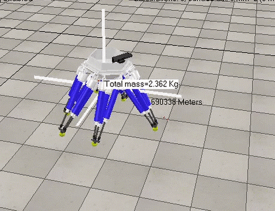

This is my first paper(my first shot in reinforcement learnning, and in writting papers), originally from a course project for introduction of reinforcement learning.

The goal is to train a hexpod learn to walk. 

> locomotion control for robot to walk

> higher level control for robot to naviate

[Download paper here](http://yangcyself.github.io/files/HexpodPaper.pdf)
