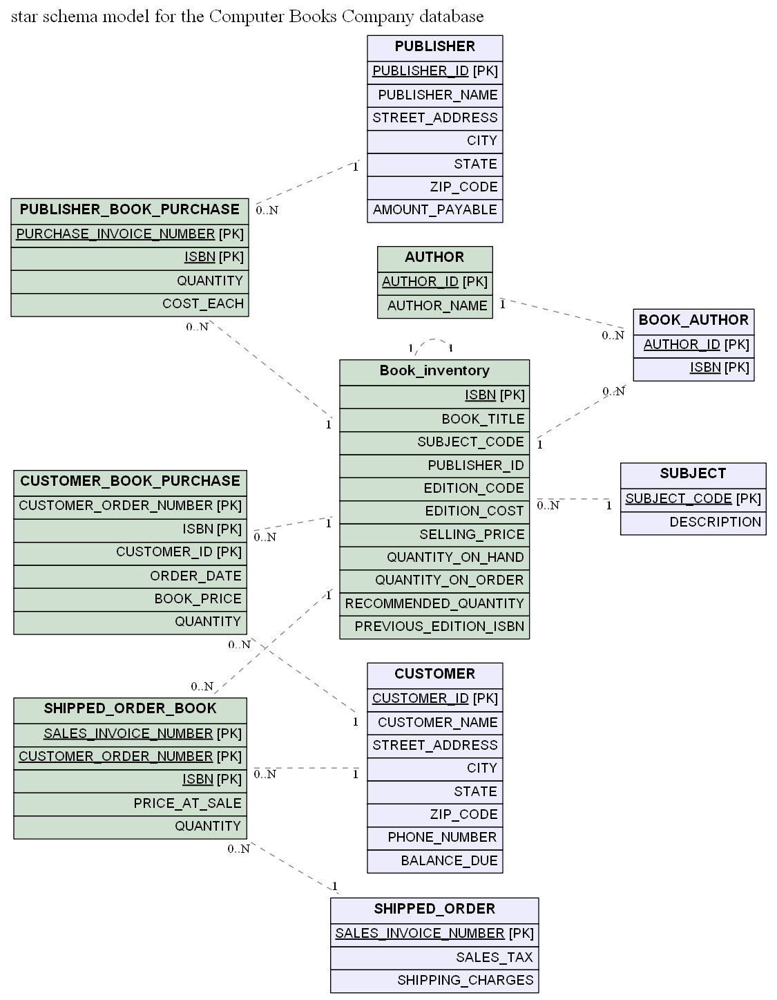
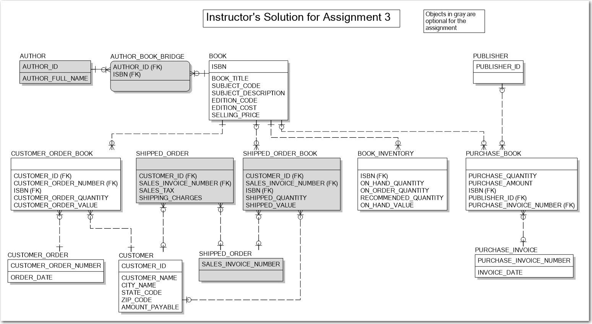

# Homework feed_back
Nice work on the assignment. My solution is attached and my comments appear below. In star schemas, fact tables do not usually have declared primary keys. It is not necessarily incorrect to declare them, but if you define primary key constraints on the fact tables, they can get in the way of some ETL (extract-transform-load) operations, particularly when data has to be reloaded. 
- **AUTHOR**: You have this shaded green like it is a fact table, but it has no facts, so it is really a dimension. It is perfectly o.k. to have a dimension associated with a bridge table (BOOK_AUTHOR), so you should represent AUTHOR asa dimension. 
- **Book_Inventry**: The looks o.k. as a fact table. However, you connected it with other facts tables (PUBLISHER_BOOK_PURCHASE, CUSTOMER_BOOK_PURCHASE, and SHIPPED_ORDER-BOOK), which is not allowed in a star schema. To fix this, a BOOK dimension should be created with ISBN as the key, and then move BOOK_TITLE, PUBLISHER_ID, EDITION_CODE, and perhaps PREVIOUS_BOOK_ISBN to the dimension table. The BOOK dimension can then be connected to the other fact tables instead of the Book_Inventory fact. 
- **SHIPPED_ORDER**: SALES_TAX and SHIPPING_CHARGES are facts. While it isn't necessarily incorrect to place facts in dimension tables, a lot of commercial query tools for star schemas have difficulty with (or flat out don't support) facts in dimensions. It's not clear from the source database schema whether SALES_TAX and SHIPPING_CHARGES can be pro-rated at the book (ISBN) level, but if so (and I asummed so in my solution), you can move them to the SHIPPED_ORDER_BOOK fact table. It appears you missed that the source database covers not only the Computer Books Company selling books to customers, but also the purchases of books from Publishers. Therefore you are missing the fact table that shows those purchases (grain of Publisher ID, Purchase Invoice Number, and ISBN). Non-additive facts: The prices and costs (for example, Edition Code and Edition Selling Price) are non-additive facts, meaning they cannot be simply summed when aggregating fact table rows. While it is not incorrect to include them in a fact table (and many designers do so), I avoid them because experience has shown me that less savy business users will sum them, and then blame the designer when the result doesn't make sense. See my attached document for a more detailed explanation. [No point reduction].

**My soluiton**

**instructor's solution**
