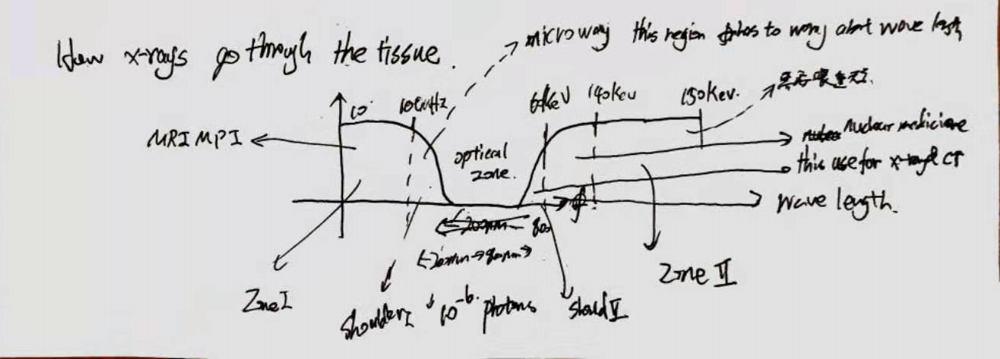

# CUE
- Explain why purple is not in spectral but we still see it in the rainbow?
- 如何冷却x-ray 真空管中的金属
- 画出不同波长的Tissue Attenuation 示意图，并且解释每个波段的能不能加以利用
# Purple is not in the spectral!

When Newton studied the prism, he named the what we today called blue as violet, what we called yank as blue.

涉及到人类颜色的原理, 人类的视锥细胞分辨RGB, 所以理论上来讲只能分辨红色蓝色以及绿色组成的convex hull里面的波长， 这里面没有紫！

但是由于光谱上是红 绿 蓝， 如果red cone cell 和 blue cone cell 同时激活(fire)， 但是绿色视锥细胞没有反应，人类的大脑自创了一个颜色，紫色。

为什么彩虹里面有紫色，是因为彩虹往往不是一个彩虹，而是一堆彩虹的组合，所以边缘处会有红色和蓝色混合形成紫色

> our eyes have much lower color spatial frequencies than gray scale.

# 回到x-ray 的图像问题

假设 aperture plane 有一个图像$\text{Fred}(x)$ 那么在source plane的一个tiny source 照射下会在 image plane 产生 $\text{Fred}(\frac{2x}{d})$ 如果source 不是tiny source, 那么source plane上面的一个$\delta(\frac{x - p\Delta x}{\Delta x})$ 在 imageplane产生的图像是
$$
\text{Fred}\left( \frac{z}{d}(x+P\Delta x\frac{d-z}{z}) \right)
$$

这个可以推出后面的卷积公式

# 如何冷却x-ray 真空管中的金属
answer: turnning it. The metal always have one side slope

> dual energy x-ray)(dual source) can make color image

## 如何解释一个毛玻璃进的东西看的清楚

this is because of aperture change

## Tissue Attenuation of 

the whole picture of tissue attentuation vs wave is like 

so the general idea is:

- Zone1 Zone2, ---- No constrast
  - but Zone2 is suitable if we use other elements
    - 我感觉是重元素标记之类的吧
- shoulder 1 $\lambda$ a big problem, CM resolution
  - 波长太小，需要考虑各种phase的问题了
- shoulder 2, good