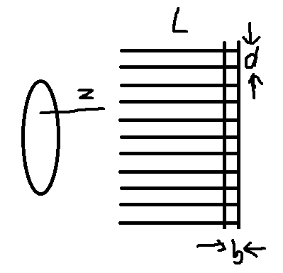

# CUE

# model the scintigraphy

- b is the thickness of the detector
- L is the length of the collimators
- Z is the distance from the source to the collimators
- d this the displace of the collimators

Calculate the FWHM of this model

$$
FWHM = \frac{d(|z|+L+b)}{L}
$$

> To get this, consider $\tan (\frac{\theta\text{cutoff}}{2}) = \frac{\text{finite Support}/2}{L+|z|+b} = \frac{d}{L}$

thus the finite support is 
$\frac{2d(|z|+L+b)}{L}$

and as the PSF is triangle function, so
$$
FWHM = \frac{d(|z|+L+b)}{L}
$$

## How to do 3D imaging

still do **Ramp filtered back projection**

>**Note**, we don't have to take the natural law

> crystal converts 140kev to optical\
> SNR $\propto \sqrt{N_\text{photons}}$ 

In theory, turn the angle from $0$ to $\pi$ is enough, but in practical go $2\pi$ because of the body attenuation.

**Myocardial:** the musel forms your heart, never tired, very different from other musals.

# CT & emission CT

Both source distribution andd attenuation are estimated

solve both unknown source map and unknown attenuation map

Sitll an open topic, but can solve combined with CT. 
> took a CT of 140 Kev to get the attenuation map

# PET

The best for imaging cancer.
- exmensive
- long time
- high rediation does

## use postiion emmittors
$$
^{18} F \rightarrow ^{18}O + \beta ^{+} \text{正电子} 
$$

正负电子annihilates and gets 511Kev $\gamma$-ray

use annihilation coincidence dectection