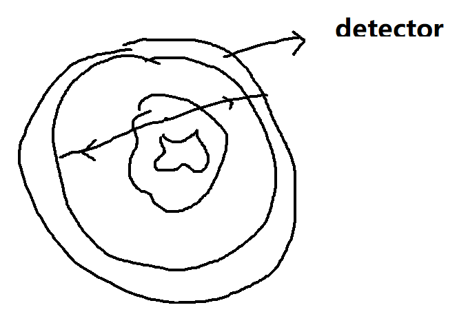
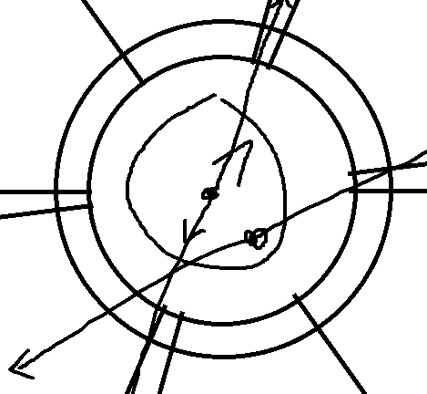

# CUE

# tumor property
look at exactly as normal cells, almost same electric property

but different in hyperbolic

Glucose$^{18}O$

Fluorodeoxyglucose: $t_{1/2} = 110\text{min}$

set a conicidence window $10ms$

the window should be very short so we don't be fooled by other photons

see pic1

## types of events

- real
- scatter
  - the direction is not in a line(go off and false angle)
  - can be filtered, scattered photon will be lower energy
- random
  - more than one annihilation
  - phonton go through detector
  - To remove random, make a picture of the randoms and substracting it.
    - the random is sampled by longer waiting time and get rid of the appearent coincide poles

## question:  How to make sure no alising

When we do filtered back projection

Do the 10ms bunches in about 1.5 hours

Each sample(annihilation) is a sample of a $\theta$ and a $l$

## How to garentee spatical resolution

blur is decided by the **does**

> note we do not need collunators

# PET: 2D imaing v.s 3D imaging

use collimators or not

with no collimators about 50% phontons are scattered

Blood reaction occurs in obout 3 second. Visition stimulation, and auditory stimulation

> but the radition is too large

If you already have treatment, the only thing trustworthy in detecting tumor is PET

# PET practical issues

## The detector must have some thickness

fig2

如果放射源的位置太偏，射线穿过的探测器的厚度就有限，可能探测不到

detection efficient $1-e^{-\mu x}$

## Photons do not goes in opposite $180$

## attenuation
only a fraction $e^{-\int u dx}$ of the events detected

about $85\%$ of the photon

# PET/CT merged

Should we do the CT simutaneously with the PET

No, because of the photons in PET

It does not need to be simutaneous and very cost to be simutaneous

## PET/CT

kbp: max of the energy of photons of the x-ray 

first CT get two pictures
- reference image
- attenuation correction

Then PET:
- annhilation activity map

# How $Tc-99m$ is made
$$
^{235} U \rightarrow ^{99} Mo   \rightarrow ^{99m} Tc\rightarrow ^{99} Tc+140\gamma -ray
$$

$^{99} Mo$ falf life 67 hours

# MRI

preferred for brain, sping, joints

wave length of a typical MRI

about $55cm$

resolution will be $55cm$ if it is difection limited